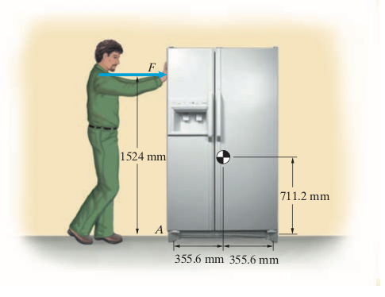
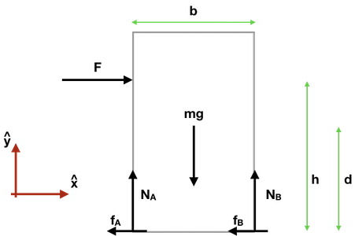

# Mekanik II, problem 18.2

A horizontal force F =133.4 N is applied to the 1023 N refrigerator as shown. 

The coefficient of kinetic friction at A and B is $\mu_k = 0.1$.

(a) What is the magnitude of the refrigerator’s acceleration?

(b) What normal forces are exerted on the refrigerator by the floor at A and B?

# Lösning:

<details>
    <summary>
        <h2>Friläggning<br></h2>
    </summary>
Börja med att frilägga kylskåpet.



Följande krafter: $\mathbf{F}$, $m\mathbf{g}$, $\mathbf{N}_A$, $\mathbf{N}_B$, $\mathbf{f}_A=-\mu N_A \hat{x}$, och $\mathbf{f}_B=-\mu N_B \hat{x}$ verkar på kylskåpet.

För systemet är accelerationen $\mathbf{a}$ samt normalkrafterna $\mathbf{N}_A$ och $\mathbf{N}_B$ obekanta och behöver bestämmas. 
</details>

<details>
    <summary>
        <h2>Fysikaliska samband<br></h2>
    </summary>
Om vi antar att kylskåpet glider utan att välta kan vi använda Euler I för kraftjämvikt i $\hat{y}$ och en ändlig acceleration i $\hat{x}$. 

Eftersom vi har tre obekanta storheter behöver vi fler samband och kan därför även använda Euler II för momentjämvikt i $\hat{z}$.  
</details>

<details>
    <summary>
        <h2>Kraftanalys: Euler I <br> </h2>
    </summary>
Euler I: $\sum_i \mathbf{F}_i = \mathbf{F} + m\mathbf{g} + \mathbf{N}_A + \mathbf{N}_B +  \mathbf{f}_A + \mathbf{f}_B  = m\mathbf{a}$

Komposantuppdelning i $\hat{x}$- och $\hat{y}$-led av verkande krafter gör att vi kan formulera Euler I i vardera riktning.

$\hat{x}$: $F-\mu N_A-\mu N_b = ma$ **(I)**

$\hat{y}$: $N_A + N_b - mg = 0$ **(II)**
</details>

<details>
    <summary>
        <h2>Momentanalys: Euler II<br></h2>
    </summary>
    
Euler II : $\sum_i \mathbf{M}^P_i = \sum_i \mathbf{r}_i \times \mathbf{F}_i = 0$
där $\mathbf{r}_i$ är vektorn från momentpunkten $\mathbf{P}$ till där respektive kraft verkar på systemet. Ekvationen stämmer för vilken val av $\mathbf{P}$ som helst. 

I det här fallet väljer vi att sätta momentpunkten till masscentrums läge. Det är ett bra val här eftersom vi söker $\mathbf{N}_A$ och $\mathbf{N}_B$ som båda ger ändliga moment med avseende på masscentrum. Om vi i stället hade valt något av de nedre hörnen av kylskåpet som momentpunkt så skulle en av de två sökta krafterna inte ge något moment och den kraften skulle därför inte kunna bestämmas.

För det aktuella systemet har vi 

$\mathbf{r}_F = -\frac{b}{2} \hat{x} + (h-d) \hat{y}$

$\mathbf{r}_{N_A} = \mathbf{r}_{f_A} = -\frac{b}{2} \hat{x} - d \hat{y}$

$\mathbf{r}_{N_B} = \mathbf{r}_{f_B} = \frac{b}{2} \hat{x} - d \hat{y}$

$\mathbf{r}_{mg} = 0$


De individuella momenten blir

$\mathbf{M}_F = \mathbf{r}_F \times \mathbf{F} = (-\frac{b}{2} \hat{x} + (h-d) \hat{y}) \times (F \hat{x}) = -F (h-d)  ~\hat{z}$

$\mathbf{M}_{N_A} = \mathbf{r}_{N_A} \times \mathbf{N}_A = (-\frac{b}{2} \hat{x} - d \hat{y}) \times (N_A \hat{y}) = -\frac{N_A b}{2}  ~\hat{z}$

$\mathbf{M}_{N_B} = \mathbf{r}_{N_B} \times \mathbf{N}_B = (\frac{b}{2} \hat{x} - d \hat{y}) \times (N_B \hat{y}) =  \frac{N_B b}{2}  ~\hat{z}$

$\mathbf{M}_{f_A} = \mathbf{r}_{f_A} \times \mathbf{f}_A = (-\frac{b}{2} \hat{x} - d \hat{y}) \times (- \mu N_A \hat{x}) =  -\mu N_A d  ~\hat{z}$

$\mathbf{M}_{f_B} = \mathbf{r}_{f_B} \times \mathbf{f}_B = (\frac{b}{2} \hat{x} - d \hat{y}) \times (-\mu N_B \hat{x}) =  - \mu N_A d  ~\hat{z}$


Eftersom alla moment verkar i $\hat{z}$-led kan vi skriva Euler II i $\hat{z}$

$\hat{z}: -F(h-d)  - \frac{N_A b}{2} +  \frac{N_B b}{2}  -\mu N_A d  - \mu N_B d = 0$

$\hat{z}: -\frac{Fh}{2}  -N_A (\frac{ b}{2} + \mu d)  +  N_B (\frac{ b}{2}  - \mu d)   = 0$  **(III)**
</details>

<details>
    <summary>
        <h2>Ekvationslösning<br></h2>
    </summary>

Från (II) kan vi lösa ut att 

$N_A+N_B=mg$ **(IV)**

vilket insatt i (I) ger

$F-\mu mg = ma$

som ger svaret på uppgift (a) där accelerationen $a$ söktes:
$a= \frac{F-\mu mg}{m}=0.3~(m/s^2)$.

Sätter vi in (IV) i (III) kan vi lösa ut $N_A$

$- F (h-d)  - N_A (\frac{ b}{2} + \mu d)  +  (mg-N_A) (\frac{ b}{2}  -\mu d)   = 0$

$N_A \left( (\frac{ b}{2} + \mu d) + (\frac{ b}{2}  -\mu d) \right) = -F(h-d) + mg (\frac{ b}{2}  -\mu d)$

$N_A b = -F(h-d) + mg (\frac{ b}{2}  - \mu d)$

$N_A = -\frac{F (h-d)}{b} + mg (\frac{ 1}{2}  -\frac{\mu d}{b})  = {256.7~(N)}$

Med $N_A$ känd kan vi beräkna $N_B$ från (IV)

$N_B = mg - N_A = 766.3~(N)$

$N_A$ och $N_B$ var de normalkrafter som söktes i uppgift (b).
</details>

<details>
    <summary>
        <h2>Analys<br></h2>
    </summary>
Att $N_B$ är större än $N_A$ är rimligt eftersom $\mathbf{F}$ ger ett kraftmoment som lägger tyngden mer på det nedre högra hörnet. Hade kylskåpet börjat välta hade $N_A$ helt försvunnit.

Momentjämvikten hade också kunnat behandlas med momentpunkten satt där $F$ angriper kylskåpet.
</details>

**Beräkning med insatta värden:**


```python
from ipywidgets import interact, interactive
from ipywidgets import FloatSlider
import numpy as np
from IPython.display import HTML


```


```python
HTML('''<script>
code_show=true; 
function code_toggle() {
 if (code_show){
 $('div.input').hide();
 } else {
 $('div.input').show();
 }
 code_show = !code_show
} 
$( document ).ready(code_toggle);
</script>
<form action="javascript:code_toggle()"><input type="submit" value="Tryck här för att dölja/visa koden."></form>''')
```


<script>
code_show=true; 
function code_toggle() {
 if (code_show){
 $('div.input').hide();
 } else {
 $('div.input').show();
 }
 code_show = !code_show
} 
$( document ).ready(code_toggle);
</script>
<form action="javascript:code_toggle()"><input type="submit" value="Tryck här för att dölja/visa koden."></form>


```python
# Set parameters according to exercise description

G = 9.81  # acceleration due to gravity, in m/s^2
F = 133.4
h = 1.524
H = 1.800
d = 0.711
b = 2*0.3556

mu = 0.1

m = 1023/G

I = 1.0/12.0*m*(H**2+b**2)
```


```python
def e_18_2(F,mu):

    a=max(0.0,(F-mu*m*G)/m)
    Na=max(0.0,-F*(h-d)/b+m*G*(1/2-mu*d/b))
    Nb=max(0.0,m*G-Na)
    print("Accelerationen a= ",'{:4.2f}'.format(a),"m/s^2")
    print("Normalkraften N_A= ",'{:6.1f}'.format(Na),"N")
    print("Normalkraften N_B= ",'{:6.1f}'.format(Nb),"N")


    return a,Na,Nb
```


```python
s_18_2=interactive(e_18_2, 
              F=FloatSlider(min=0.0,max=200,value=133.4),
              mu=FloatSlider(min=0.0,max=0.20,value=0.1,step=0.01))
display(s_18_2)
```


    interactive(children=(FloatSlider(value=133.4, description='F', max=200.0), FloatSlider(value=0.1, description…


```python

```
