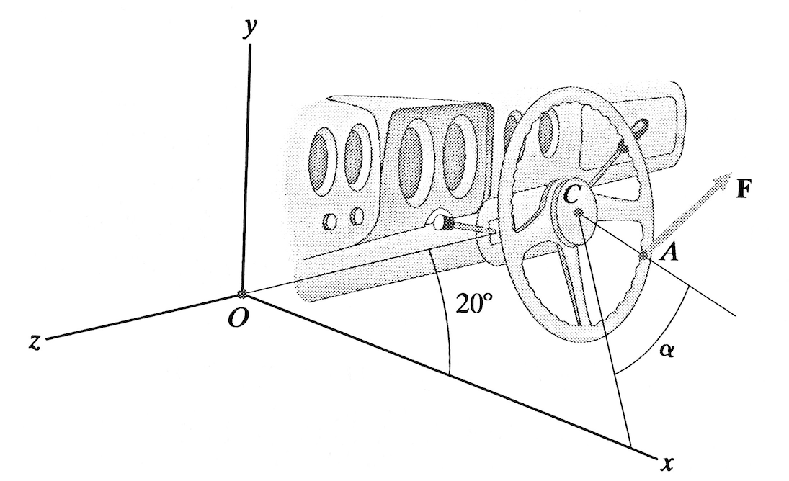
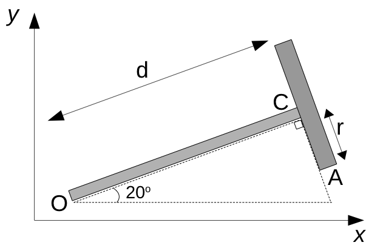
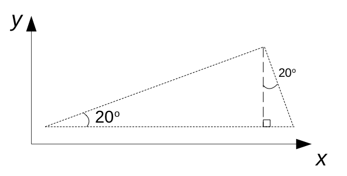

# Mekanik II, problem 4.104

The radius $r$ of the steering wheel is 200 mm. The distance $d$ from $O$ to $C$ is 1 m. The center $C$ of the steering wheel lies in the x-y plane. The driver exerts a force $\mathbf{F}=10\hat{x}+10\hat{y}-5\hat{z}$ (N) on the wheel at $A$. If the angle $\alpha = 0$, what is the magnitude about the shaft $OC$? 

# Lösning:

    

        <h2>Resonemang </h2>
    

Det som söks är momentet $\mathbf{M}_{OC}$ kring rattstången som går i riktningen $\hat{r}_{OC}$. Därför är ett lämpligt tillvägagångssätt att först bestämma momentet $\mathbf{M}_{C}$ kring rattens centrum $C$ for att sedan använda ekvationen för momentet kring en axel som ger $\mathbf{M}_{OC}=(\mathbf{M}_{C} \cdot \hat{r}_{OC}) \hat{r}_{OC}$.

    

        <h2>Krafter, moment och vektorer </h2>
    

För att kunna beräkna $\mathbf{M}_{OC}$ behöver vi först bestämma enhetsvektorn $\hat{r}_{OC}$ och kraftmomentet $\mathbf{M}_{OC}$.
    
Enhetsvektorn $\hat{r}_{OC}$ ligger i xy-planet och kan med hjälp av trigonometriska samband skrivas som 

$\hat{r}_{OC} = \cos 20 \hat{x} + \sin 20 \hat{y}$

Eftersom den enda kraft som bidrar i problemet är $\mathbf{F}$, vilken verkar med vektorn $\mathbf{r}_{CA}$ kring punkten $C$, blir kraftmomentet $\mathbf{M}_{C}=\mathbf{r}_{CA}\times\mathbf{F}$

Eftersom vinkeln $\alpha=0$ enligt uppgiften ligger punkten $A$ i samma plan som rattstången, d.v.s. i xy-planet. Även om det är svårt att se i figuren kan man anta att ratten sitter vinkelrätt mot rattstången. En projektion av systemet i xy-planet ges nedan:

För att tydligare se hur ett uttryck för $\mathbf{r}_{CA}$ kan fås kan man använda vinkelförhållanden enligt figurer nedan:

Så $\mathbf{r}_{CA}$ kan därför skrivas

$\mathbf{r}_{CA} = r \sin 20 \hat{x} - r \cos 20 \hat{y}$  (m)

och $\mathbf{F}$ är som givet i uppgiften

$\mathbf{F}=10\hat{x}+10\hat{y}-5\hat{z}$ (N)

    

        <h2>Beräkning </h2>
    

Vi börjar med att beräkna kraftmomentet $\mathbf{M}_{C}=\mathbf{r}_{CA}\times\mathbf{F}$

$\mathbf{r}_{CA} \times \mathbf{F} =  \begin{vmatrix}
&\hat{x}&&\hat{y}&&\hat{z}&\\
\\
& r \sin 20 && -r \cos 20 && 0 &\\
\\
& 10 && 10 && -5 &\\
\end{vmatrix} = 5r \cos 20 \hat{x} + 5 r \sin 20 \hat{y} + (10r\sin 20 + 10r \cos 20)\hat{z}$

Med kraftmomentet $\mathbf{M}_C$ uträknat kan vi nu räkna momentet $\mathbf{M}_{AC}$ längs rattstången $AC$. Som ett delsteg räknar vi skalärprodukten $\mathbf{M}_C \cdot \hat{r}_{AC}$:

$\mathbf{M}_C \cdot \hat{r}_{AC} = 
(\cos 20 \hat{x} + \sin 20 \hat{y}) \cdot (5r \cos 20 \hat{x} + 5 r \sin 20 \hat{y} + 20r\sin 20 \hat{z}) = \\
5r \cos^2 20 + 5r \sin^2 20 + 0 = 5r ( \cos^2 20 + \sin^2 20) = 5r $ 

Vilket ger oss kraftmomentet kring $AC$ som:

$\mathbf{M}_{AC} = (\mathbf{M}_C \cdot \hat{r}_{AC})\hat{r}_{AC} = 
5r (\cos 20 \hat{x} + \sin 20 \hat{y}) = 5r \cos 20 \hat{x} + 5 r \sin 20 \hat{y}$

Med insatt värde $r=0.2 m$ blir $\mathbf{M}_{AC} = 5r \cos 20 \hat{x} + 5 r \sin 20 \hat{y} =  \cos 20 \hat{x} + \sin 20 \hat{y}$ (Nm)

Normen av $\mathbf{M}_{AC}$ ger oss magnituden ${M}_{AC}$ som söktes i uppgiften:

${M}_{AC} = \sqrt{\cos 20 \hat{x} + \sin 20 \hat{y}} = \sqrt{1} = 1$ (Nm)

(Notera att redan skalärprodukten $\mathbf{M}_C \cdot \hat{r}_{AC}$ gav oss magnituden eftersom $\hat{r}_{AC}$ är en enhetsvektor).

    

        <h2>Svar </h2>
    

Magnituden av kraftmomentet kring $AC$ är ${M}_{AC} = 1$  (Nm)
   

