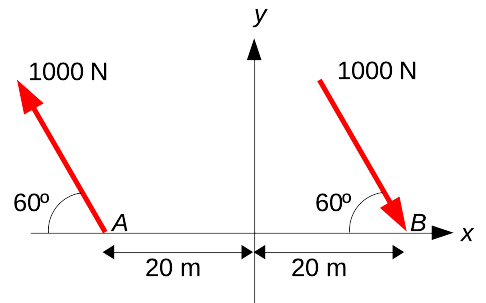
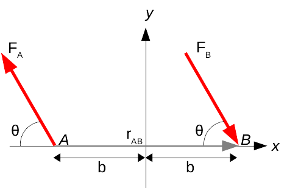

# Mekanik II, problem 4.109

The forces are contained in the xy-plane. 

(a) Determine the moment of the couple.

(b) What is the sum of the two moments about the point $\mathbf{P}$=(10,-40,20) m?

# Lösning:

    

        <h2>Resonemang </h2>
    

De två krafterna lika stora och motriktade. Därför bildar dem ett kraftpar. Ett kraftpar har den speciella egenskapen att det totala kraftmomentet från kraftparet är konstant oavsett momentpunkt. Därför kan vi välja en godtycklig punkt $P$ och beräkna kraftmomentet $\mathbf{M}_P$ för den valda punkten. Det ger oss då det konstanta kraftmomentet från vårt kraftpar.

    

        <h2>Krafter, moment och vektorer </h2>
    

För att kunna beräkna $\mathbf{M}_{P}$ behöver vi först bestämma en lämplig punkt $P$. Därefter ger momentekvationen att 

$\mathbf{M}_P = \sum_i \mathbf{r_i} \times \mathbf{F_i}$

där $\mathbf{r}_i$ är vektorn från momentpunkten $\mathbf{P}$ till där respektive kraft $\mathbf{F}_i$ verkar.

Vi inför beteckningar för krafter, avstånd och vinklar enlig figuren nedan:

Ett praktiskt val av $P$ är att där en av krafterna skär x-axeln, dvs vid $A$ eller $B$. För då kommer dels den kraften inte ge upphov till något kraftmoment (eftersom $r_{AA}=r_{BB}=0$ där), och ortsvektorn från momentpunkten till den andra kraften ($\mathbf{r}_{AB}$ eller $\mathbf{r}_{BA}$ kommer endast ha en ändlig komponent i x-led.

Låt oss välja $A$ som momentpunkt, d.v.s. vi bestämmer $\mathbf{M}_{A}=\mathbf{r}_{AB}\times\mathbf{F}_B$

där $\mathbf{F}_B$ är den högra kraften i figuren, d.v.s. den som korsar x-axeln i $B$. Då får vi

$\mathbf{r}_{AB}=2b \hat{x}$ m

$\mathbf{F}_B= F_B \cos 60 \hat{x} - F_B \sin 60 \hat{y}$ N

    

        <h2>Beräkning </h2>
    

Med $\mathbf{r}_{AB}$ och $\mathbf{F}_B$ kända kan vi beräkna $\mathbf{M}_{A}$.

$\mathbf{M}_{A}=\mathbf{r}_{AB}\times\mathbf{F}_B  =  (2b \hat{x}) \times ( F_B \cos 60 \hat{x} - F_B \sin 60 \hat{y}) 
= F_b\begin{vmatrix}
&\hat{x}&&\hat{y}&&\hat{z}&\\
\\
& 2b  && 0 && 0 &\\
\\
& \cos 60 && -\sin 60 && 0 &\\
\end{vmatrix} = \\
= -2bF_B \sin 60 \hat{z}$

    

        <h2>Svar </h2>
    

(a) Med insatta värden, $b$=20 m och $F_B$=1000 N blir det resulterande kraftmomentet $\mathbf{M}_A=-34.6 \hat{z}$ (kN)

(b) Eftersom kraftmomentet från ett kraftpar är oberoende av momentpunkt är kraftmomentet i (10.-40,20) m samma som $\mathbf{M}_A$, d.v.s. $\mathbf{M}=-34.6 \hat{z}$ (kN)

