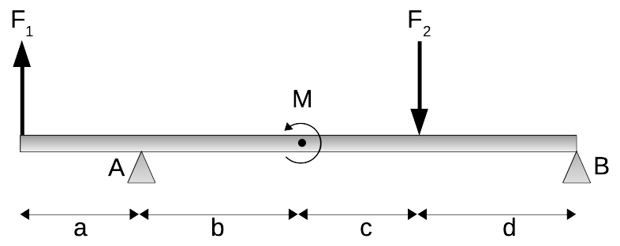

# Mekanik II, problem 4.116

Determine the sum of moments exerted about A by the couple and the two forces.

Here $F_1$=100 N, $F_2$=400 N, $M$=900 Nm, $a$=$c$=3 m, and $b$=$d$=4 m.




# Lösning:

<details>
    <summary>
        <h2>Resonemang<br></h2>
    </summary>
Det som söks är $\mathbf{M}_A$. Bidragen från krafterna $F_1$ och $F_2$ kan beräknas med momentekvationen $\mathbf{M}=\mathbf{r}\times\mathbf{F}$ och bidraget från momentet $M§ är lika stort för alla val av momentpunkter i systemet.
</details>

<details>
    <summary>
        <h2>Krafter, moment och vektorer<br></h2>
    </summary>
För kraftmomentet $\mathbf{M}_{A}$ ger momentekvationen att

$\mathbf{M}_A = \sum_i \mathbf{M}_i =
\mathbf{r}_{F_1} \times \mathbf{F}_1 + \mathbf{r}_{F_2} \times \mathbf{F}_2 + \mathbf{M}$

där $\mathbf{r}_i$ är vektorn från momentpunkten $\mathbf{A}$ till där respektive kraft $\mathbf{F}_i$ verkar.

För ett koordinatsystem (syns ej i figur här) med y-axeln uppåt och x-axeln åt höger kan krafter och ortsvektorer skrivas som

$\mathbf{F}_1 = F_1 \hat{y}$

$\mathbf{F}_2 = -F_2 \hat{y}$

$\mathbf{r}_{F_1} = -a \hat{x}$

$\mathbf{r}_{F_2} = (b+c) \hat{x}$

</details>

<details>
    <summary>
        <h2>Beräkning<br></h2>
    </summary>
Med bestämda krafter och ortsvektorer kan vi räkna delbidragen till kraftmomentet $\mathbf{M}_{A}$.


$\mathbf{r}_{F_1} \times \mathbf{F}_1  =  (-a \hat{x}) \times ( F_1 \hat{y}) 
= \begin{vmatrix}
&\hat{x}&&\hat{y}&&\hat{z}&\\
\\
& -a  && 0 && 0 &\\
\\
& 0 && F_1 && 0 &\\
\end{vmatrix} = -F_1 a  \hat{z}$

$\mathbf{r}_{F_2} \times \mathbf{F}_2  =  (b+c \hat{x}) \times ( -F_2 \hat{y}) 
= \begin{vmatrix}
&\hat{x}&&\hat{y}&&\hat{z}&\\
\\
& b+c  && 0 && 0 &\\
\\
& 0 && -F_2 && 0 &\\
\end{vmatrix} = -F_2 (b+c)  \hat{z}$

och eftersom z-axeln i detta system pekar ut ur planet kan vi bestämma riktningen för kraftmomentet $\mathbf{M}$ som
$\mathbf{M}=M\hat{z}$


Summan av alla bidrag ovan ger det totala kraftmomentet i $A$ som

$\mathbf{M}_A= -F_1 a  \hat{z}  -F_2 (b+c) \hat{z} + M \hat{z} = (M-F_1 a -F_2 (b+c)) \hat{z}$


</details>

<details>
    <summary>
        <h2>Svar<br></h2>
    </summary>
Med insatta värden blir kraftmomentet $M_A$

$M_A = 900 - 100*3 - 400 * (3+4) = -2200$ (Nm).

Riktningen för $M_A$ är i moturs ($-\hat{z}$) riktning.
</details>

<details>
    <summary>
        <h2>Kommentar<br></h2>
    </summary>
För "enkla" kryssprodukter, där krafter och ortsvektorer är riktade längs någon av koordinatsystemets axlar, kan resulterande kraftmoment enkelt räknas ut utan att behöva använda determinanter. I stället kan man använda cyklisk permutation som säger att $\hat{x}\times \hat{y}=\hat{z}$, $\hat{y}\times \hat{z}=\hat{x}$ och $\hat{z}\times \hat{x}=\hat{y}$ och antikommutivitet som säger att $\mathbf{v}\times\mathbf{u}=-\mathbf{u}\times\mathbf{v}$. 

För kryssprodukterna i den aktuella uppgiften kan vi använda det för att snabbt se att 

$-a\hat{x}\times{F}_1\hat{y}= -a F_1 (\hat{x}\times\hat{y}) = -a F_1 \hat{z}$

$(b+c)\hat{x}\times(-{F}_2\hat{y})= (b+c)(-F_2) (\hat{x}\times\hat{y}) = -(b+c)F_2 \hat{z}$


</details>


```python

```
