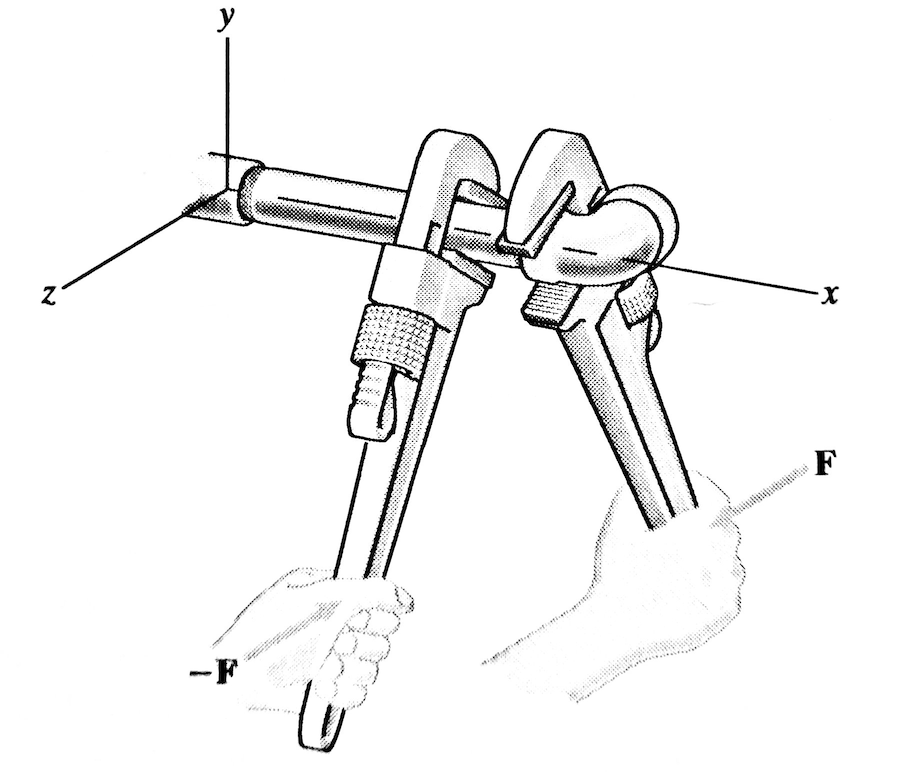

# Mekanik II, problem 4.127

Two wrenches are used to tighten an elbow fitting. The force $\mathbf{F}_1=\mathbf{F}=50 \hat{z}$ on the right wrench is applied at $\mathbf{r}_1=(150,-125,-75)$ mm, and the force $\mathbf{F}_2=-\mathbf{F}$ on the left wrench is applied at $\mathbf{r}_2=(100,-125,75)$ mm.

(a) Determine the moment about the x-axis due to the force of exerted on the right wrench.

(b) Determine the moment of the couple formed by the forces exerted on the two wrenches.

(c) Based on the results of (a) and (b), explain why two wrenches are used.



# Lösning:

<details>
    <summary>
        <h2>Resonemang<br></h2>
    </summary>
Här kan vi använda oss av momentekvationen $\mathbf{M}=\mathbf{r}\times\mathbf{F}$ för de individuella krafterna $\mathbf{F}_1$ och $\mathbf{F}_2$. 
    
Kraftmomentet kring en generell axel $\mathbf{v}$ kan beräknas som  $\mathbf{M}_v=(\mathbf{M}_P \cdot \hat{v})\hat{v}$ där $P$ är en punkt på axeln $\mathbf{v}$.

Kraftmomentet från ett kraftpar är konstant oberoende av val av momentpunkt.

</details>

<details>
    <summary>
        <h2>Krafter, vektorer och moment<br></h2>
    </summary>

I uppgift (a) söks kraftmomentet kring x-axeln och vi kan då välja vilken punkt som helst längs axeln för momentberäkningen. Här kan vi välja origo då vi vet ortsvektorerna till krafterna från origo. Krafter och ortsvektorer blir då

$\mathbf{F}_1 = 50 \hat{z}$ (N)

$\mathbf{r}_1 = 150 \hat{x} -125 \hat{y} -75 \hat{z}$ (mm)

$\mathbf{F}_2 = -50 \hat{z}$ (N)

$\mathbf{r}_2 = 100 \hat{x} -125 \hat{y} + 75 \hat{z}$ (mm).

Kraftmomentet i origo $\mathbf{M}_o$ från den högra tången skrivs då som

$\mathbf{M}_o = \mathbf{r}_1 \times  \mathbf{F}_1$

och kraftmomentet längs x-axeln blir

$\mathbf{M}_x = (\mathbf{M}_o \cdot \hat{x})\hat{x} = ((\mathbf{r}_1 \times  \mathbf{F}_1)\cdot\hat{x}) \hat{x}$


</details>

<details>
    <summary>
        <h2>Beräkning, uppgift (a)<br></h2>
    </summary>
Med bestämda krafter och ortsvektorer kan vi beräkna kraftmomentet $\mathbf{M}_{x}$.


$\mathbf{r}_{1} \times \mathbf{F}_1  =  
(150 \hat{x} -125 \hat{y} -75 \hat{z}) \times (50 \hat{z}) 
= \begin{vmatrix}
&\hat{x}&&\hat{y}&&\hat{z}&\\
\\
& 150  && -125 && -75 &\\
\\
& 0 && 0 && 50 &\\
\end{vmatrix} = -6250 \hat{x} - 7500 \hat{y}$ (Nmm) = <br>
= $-6.25 \hat{x} - 7.50 \hat{y}$ (Nm) 


Vilket ger kraftmomentet längs x-axeln $\mathbf{M}_x$ som

$\mathbf{M}_x=((-6.25 \hat{x} - 7.50 \hat{y})\cdot\hat{x})\hat{x}= (-6.25 (\hat{x}\cdot\hat{x}) - 7.50 (\hat{y}\cdot\hat{x})\hat{x}= -6.25\hat{x}$ (Nm)

som då blir svaret för fråga (a).


</details>

<details>
    <summary>
        <h2>Beräkning, uppgift (b)<br></h2>
    </summary>
För att få kraftmomentet från kraftparet $\mathbf{F}_1$ och $\mathbf{F}_2$ behöver nu även beräkna kraftmomentet från kraften $\mathbf{F}_2$. (Momentet från $\mathbf{F}_1$ beräknades i uppgift (a)).

$\mathbf{r}_{2} \times \mathbf{F}_2  =  
(100 \hat{x} -125 \hat{y} + 75 \hat{z}) \times (-50 \hat{z}) 
= \begin{vmatrix}
&\hat{x}&&\hat{y}&&\hat{z}&\\
\\
& 100  && -125 && 75 &\\
\\
& 0 && 0 && -50 &\\
\end{vmatrix} = 6250 \hat{x} + 5000 \hat{y}$ (Nmm) = <br>
= $6.25 \hat{x} + 5.0 \hat{y}$ (Nm).


Det totala kraftmomentet från kraftparet blir då 

$\mathbf{r}_{1} \times \mathbf{F}_1 + \mathbf{r}_{2} \times \mathbf{F}_2 = - 2.5\hat{y}$ (Nm). 

som då blir svaret för fråga (b).


</details>

<details>
    <summary>
        <h2>Alternativ beräkning, uppgift (b)<br></h2>
    </summary>
I stället för att räkna ut de två bidragen till kraftparets kraftmoment $\mathbf{M}$ som
    
$\mathbf{M} =\mathbf{r}_{1} \times \mathbf{F}_1 + \mathbf{r}_{2} \times \mathbf{F}_2$ 

kan vi använda oss av kända samband för kraftpar, nämligen att eftersom $\mathbf{F}_1=-\mathbf{F}_2$ kan vi skriva $\mathbf{M}$ som:

$\mathbf{M} =\mathbf{r}_{1} \times \mathbf{F} + \mathbf{r}_{2} \times \mathbf{-F} = 
\mathbf{r}_{1} \times \mathbf{F} - \mathbf{r}_{2} \times \mathbf{F} = 
(\mathbf{r}_{1}  - \mathbf{r}_{2} )\times \mathbf{F}$

Beräknar vi den slutliga kryssprodukten får vi


$\mathbf{M} = (\mathbf{r}_{1}  - \mathbf{r}_{2} )\times \mathbf{F}  =  
(50 \hat{x} - 150 \hat{z}) \times (50 \hat{z}) 
= \begin{vmatrix}
&\hat{x}&&\hat{y}&&\hat{z}&\\
\\
& 50  && 0 && -150 &\\
\\
& 0 && 0 && 50 &\\
\end{vmatrix} = -2500 \hat{y}$ (Nmm) 
= $ -2.5 \hat{y}$ (Nm).

Vilket ger samma svar som ovan för (b).


</details>

<details>
    <summary>
        <h2>Svar, uppgift (c) <br></h2>
    </summary>
Med två tänger försvinner det totala vridmomentet kring x-axeln vilket gör att systemet inte vill vrida sig, men att den packning/mutter man här vill skruva åt ändå blir påverkad av ett moment. 
    
För ett mer vardagligt exempel av nyttan av kraftpar kan man försöka skruva på locket på en vattenflaska genom att vrida på locket utan att hålla i flaskan. I det fallet ges inget motverkande kraftmoment på systemet och flaskan kommer därför rotera med locket vilken därmed inte kan skruvas på flaskan.
</details>


```python

```
