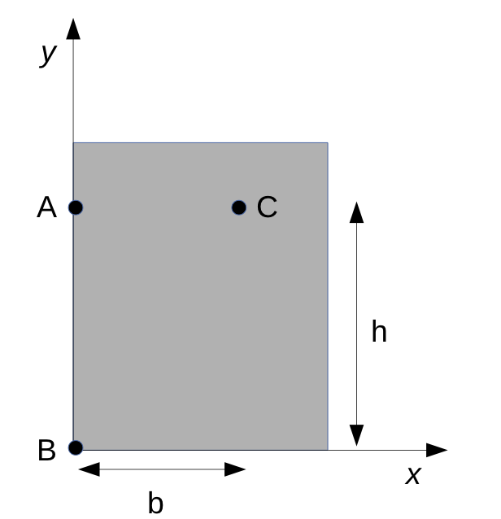
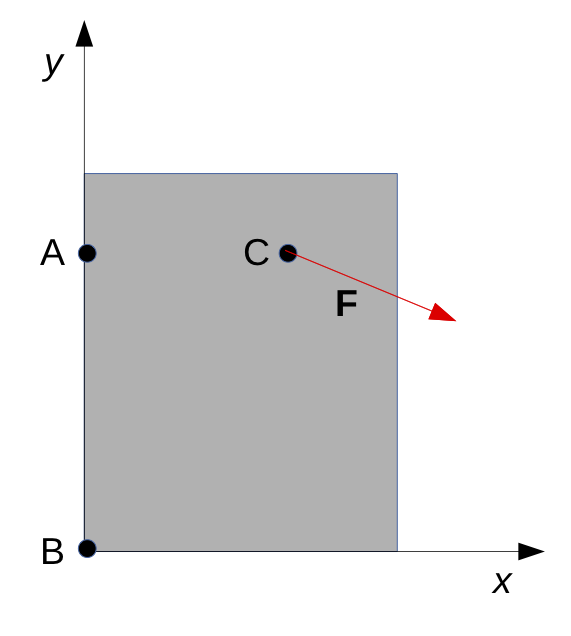

# Mekanik II, problem 4.18

A person exerts a force $\mathbf{F}=2 \hat{x} - 4 \hat{y} + 12\hat{z}$ on the gate at point C. Point C lies in the x-y plane and $b=0.6~m$ and $h=1.0~m$. What moment does the person exert about the gate's hinge axis, which is coincindent with the y-axis?


and $b=0.6~m$ and $h=1.0~m$


# Lösning:

<details>
    <summary>
        <h2>Friläggning<br></h2>
    </summary>
Börja med att frilägga grinden.



På grinden verkar visserligen tyngdkraft (masscentrum) och kontaktkrafter (vid gångjärnen) men det som söks är bara kraftmomentet från kraften $\mathbf{F}$

$\mathbf{F}=2 \hat{x} - 4 \hat{y} + 12\hat{z}$

så vi kan här bortse från övriga krafter.

Här är det kraftmomentet kring $\hat{y}$-axeln som söks.
</details>

<details>
    <summary>
        <h2>Fysikaliska samband<br></h2>
    </summary>

Generellt gäller att kraftmomentet $\mathbf{M}_v$ kring en axel $\mathbf{v}=v\hat{v}$ kan beräknas genom att först beräkna kraftmomentet $\mathbf{M}_P$ för en punkt $\mathbf{P}$ som ligger någonstans på axeln $\mathbf{v}$ och sedan använda sambandet 

 $\mathbf{M}_v = (\mathbf{M}_P \cdot \hat{v})\hat{v}$
 
    
Momentekvationen ger att 

$\mathbf{M}_P = \sum_i \mathbf{r_i} \times \mathbf{F_i}$

där $\mathbf{r}_i$ är vektorn från momentpunkten $\mathbf{P}$ till där respektive kraft $\mathbf{F}_i$ verkar. Ekvationen stämmer för vilken val av $\mathbf{P}$ som helst. 

</details>

<details>
    <summary>
        <h2>Beräkning<br></h2>
    </summary>


I det här fallet kan vi välja vilken punkt som helst $\mathbf{P}$ längs $\hat{y}$-axeln som moment punkt. Ett bra val kan vara punkten $\mathbf{A}$ efterosom vektorn $\mathbf{r}_{AC}$ endast har en komponent i x-led vilket kan underlätta beräkningarna. Den enda kraft som bidrar till det sökta momentet är $\mathbf{F}$.


För det aktuella systemet har vi 

$\mathbf{r}_{AC} = b \hat{x}$

$\mathbf{F}=2 \hat{x} - 4 \hat{y} + 12\hat{z}$

$\mathbf{M}_A= \mathbf{r}_{AC} \times \mathbf{F}$

$\mathbf{r}_{AC} \times \mathbf{F} =  \begin{vmatrix}
&\hat{x}&&\hat{y}&&\hat{z}&\\
\\
& b && 0 && 0 &\\
\\
& 2 && -4 && 12 &\\
\end{vmatrix} = -12b\hat{y} -4b\hat{z}$

Med kraftmomentet $\mathbf{M}_A$ uträknat kan vi nu räkna momentet $\mathbf{M}_y$ längs $\hat{y}$-axeln som:

$\mathbf{M}_y = (\mathbf{M}_A \cdot \hat{y})\hat{y} = ((-12b\hat{y} -4b\hat{z})\cdot \hat{y}) \hat{y} = \\
(-12b(\hat{y} \cdot \hat{y}) - 4b(\hat{z} \cdot \hat{y})) \hat{y} = (-12b * 1 - 4b*0) \hat{y} = -12b \hat{y}$


Med instatt värde $b=0.6 m$ blir $\mathbf{M}_y = -12b \hat{y} = -7.2 \hat{y} $ (Nm)


</details>

<details>
    <summary>
        <h2>Svar<br></h2>
    </summary>
Kraftmomentet kring $\mathbf{y}$-axeln är $\mathbf{M}_y = -12b \hat{y} = 7.2\hat{y}$  (Nm)
   
</details>

<details>
    <summary>
        <h2>Analys<br></h2>
    </summary>
Att x- och y-komponenterna av kraften $\mathbf{F}$ inte ger ett bidrag till kraftmomentet $\mathbf{M}_y$ kan intuitivt förstås av att dessa komponenter skulle vilja rotera grinden i xz-planet i det givna koordinatsystemet. Z-komponenten av $\mathbf{F}$ pekar ut ur planet vilket ockå gör att det är rimligt att det resulterande momentet är negativt givet uppgiftens geometri.


```python
from ipywidgets import interact, interactive
from ipywidgets import FloatSlider
import numpy as np
from IPython.display import HTML


```
